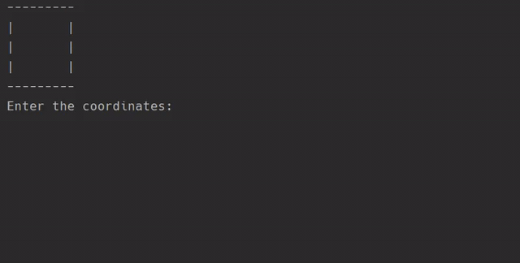

# Tic-Tac-Toe
The console based java application for one of the most famous games  : ___tic-tac-toe__ (also known as cross and noughts). 
## 

## 
&nbsp;

&nbsp;

Detailed Readme to be updated soon.Stay Tuned :-)
